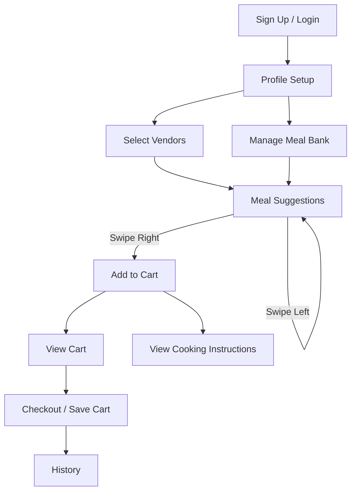

# Process Requirement Document (PRD) – Gravity Meal Planner App

---

## 1. Overview

**Goal:**  
Develop a cross-platform (Android & iOS) meal planner app, 100% hosted online (no local storage/testing), published via GitHub, Vercel, and Supabase. The app will help users plan meals based on dietary needs, budget, and vendor availability, leveraging a flexible meal/ingredient catalog sourced from the Gravity Transformation Recipe Book and future recipe bank expansion.

---

## 2. Core Features & Requirements

### 2.1 User Profile Setup
- Fields: Name, email, password (Supabase Auth), location, allergies, dietary restrictions, budget, meal sizes, diet types.
- Ingredient Profile: Allergies and diet types mapped to ingredient codes (e.g., Red-Protein, Orange-FattyProtein, etc.) as per the recipe book.
- User can select from common allergens and dietary preferences (e.g., vegetarian, keto, gluten-free).

### 2.2 Vendor Selection
- Location-based vendor lookup (Publix, Walmart, Trader Joe’s, etc.).
- User can select one or more preferred vendors.
- **Vendor Data:** All vendor deals/coupons and product data will be scraped (no APIs). Scraping logic will be modular and documented.

### 2.3 Meal Bank & Catalog
- Pre-registered meals from the Gravity Recipe Book, each with:
  - Name, ingredients (with codes), instructions, nutrition info, tags (diet, allergens), and serving size.
- User can add custom meals (same fields as above).
- Meals are filterable by diet, allergens, vendor availability, and budget.
- **Recipe Bank Expansion:** After MVP, allow user/community submissions and external recipe imports.

### 2.4 Meal Suggestion & Selection
- Suggest meals based on user profile, vendor selection, and current deals/coupons.
- Prioritize meals with ingredients on sale or with coupons at selected vendors.
- Swipable meal tickets: User can swipe left (ignore) or right (add to cart) on meal suggestions.

### 2.5 Meal Bank Management
- User can browse all meals, mark as preferred, non-preferred, or removed (for allergies/diet).
- Removed meals are excluded from suggestions.

### 2.6 Deals & Coupons Integration
- Scrape public deal/coupon data for selected vendors.
- Match deals to meal ingredients and display savings in suggestions and cart.

### 2.7 Cart & Checkout
- Shows selected meals, applied coupons, and total estimated cost.
- List of required ingredients, quantities, and vendor-specific pricing.
- No payment processing; just a summary for the user to shop in person or online.

### 2.8 History & Cooking Instructions
- User can view previous carts and meals.
- Each meal ticket links to simple cooking instructions.

### 2.9 Hosting & Deployment
- All data stored in Supabase (Postgres, Auth, Storage).
- App deployed via Vercel (Next.js/React Native Web for cross-platform).
- Source code managed on GitHub.
- No local storage or local testing; all development, testing, and deployment is cloud-based.

---

## 3. Technical Stack

- **Frontend:** React Native Web (Android/iOS + web), TypeScript
- **Backend/DB:** Supabase (Postgres, Auth, Storage)
- **Hosting:** Vercel
- **Source Control:** GitHub
- **APIs:** Vendor scraping modules, geolocation APIs

---

## 4. File Naming Convention

- All files: `[type]/[descriptiveName][_vX].[ext]`
  - Types: `components`, `services`, `models`, `utils`, `pages`, `styles`, etc.
  - Example: `components/MealTicketCard_v1.tsx`, `services/vendorScraper_publix_v1.ts`
- Suffixes like `_v1`, `_v2` for major revisions.
- Descriptive prefixes for type/purpose.
- kebab-case for folders, camelCase or PascalCase for files as per language conventions.

---

## 5. Review & Refactor Phase

- At the end of each milestone:
  - Conduct a code review to:
    - Remove redundant code
    - Simplify logic
    - Ensure all code is commented
    - Update documentation
  - Log review completion in the THD.

---

## 6. Milestones & Tasks

1. Create GitHub repo
2. Set up Vercel project & deployment
3. Set up Supabase project & DB
4. Configure environment variables (Vercel, Supabase)
5. Implement user authentication/profile
6. Model ingredient & meal data (from recipe book)
7. Build vendor scraping modules
8. Vendor selection UI
9. Meal suggestion engine
10. Swipable meal ticket UI
11. Cart & checkout flow
12. History & instructions
13. Review & refactor phase (MVP)
14. MVP deployment & smoke test
15. Recipe bank expansion (post-MVP)

---

## 7. Code Commenting

- All code must include comments explaining the purpose of key lines and blocks, especially for business logic, data models, and integration points.

---

## 8. User Flows

---

## 9. Data Models (Simplified)

- **User:** id, name, email, password, location, allergies, diet, budget, meal size, preferred vendors
- **Vendor:** id, name, location, deals/coupons
- **Meal:** id, name, ingredients[], instructions, tags, nutrition, serving size, user_id (for custom)
- **Cart:** id, user_id, meals[], total_cost, coupons_applied, date
- **History:** user_id, carts[]

---

## 10. Operational Tracking

- The THD will log not only feature tasks but also operational milestones (e.g., repo creation, environment variables, deployment URLs, API key generation, etc.).

---
